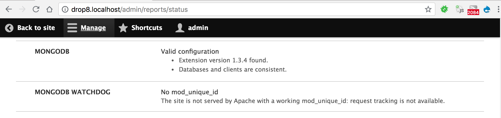

# Installation and Settings

To summarize:

- Install prerequisites
- Download the MongoDB module suite to the site
- Configure settings

## Installing the prerequisites

The MongoDB module and submodules need some configuration to be useful.
This guide assumes that :

* A [MongoDB][download] server instance has already been installed,
  configured and is available for connection from the Drupal instance,
  in a version MongoDB still supports.
  As of 2026-09-28, these are 7.0, 8.0 and 8.3: see MongoDB's [lifecycle page][lifecycle].
  8.x-2.1 was tested against MongoDB 7.0 when it was released, and against 8.3 on 2026-09-28.
  Which extension and library versions each server version needs
  is listed in MongoDB's [compatibility tables][compat].
  AWS DocumentDB and Azure CosmosDB might work but are not tested.
  Be sure to [report any issue][report] you could have with them.
* The [mongodb][mongodb] (not [mongo][mongo]) PHP extension is installed and configured,
  in a 1.x version, 1.13 or later.
  Version 2.x of the extension is not supported by 8.x-2.1.
* The [MongoDB library for PHP][PHPMongoDBlib] is a 1.x version, 1.12 or later.
  Composer installs it along with the module,
  picking the library version that matches the installed extension version.
    * These are the minimum versions 8.x-2.1 accepts, not what current setups need:
      MongoDB 7.0 needs the extension and library 1.16 or later,
      and PHP 8.4 needs them in 1.17 or later.
* The site will be running [Drupal][drupal] 10.x.
  8.x-2.1 still installs on Drupal 9.4 and 9.5,
  but Drupal 9 is end of life and no longer supported by this module.
* The module commands need [Drush][drush] 11 or later.
  8.x-2.1 registers them through `drush.services.yml`,
  which Drush 12 and 13 still load, but mark as deprecated.
  Drush 13 itself needs PHP 8.3 and Drupal 10.4 or later.
* PHP is the version required by the Drupal 10 release in use,
  and the mongodb extension must support that PHP version.
* We highly recommend [using Composer](#downloading-the-modules)
  to install and use this module, and its dependency,
  the [MongoDB extension and library for PHP][PHPMongoDBlib]

Installing MongoDB itself is best explained in these official resources
maintained by MongoDB Inc.:

* [MongoDB Mac installation][MongoDBMac]
* [MongoDB LINUX installation][MongoDBLinux]
* [MongoDB Windows installation][MongoDBWindows]

Since MongoDB 3.6, you can no longer get
a basic web admin interface by running `mongod` with the `–httpinterface`:
that feature was [removed in 3.6][removedhttp].
To some extent, this feature has been superseded by the
[free cloud monitoring][freemonitoring] service offered by MongoDB Inc.

[download]: https://www.mongodb.org/downloads

[drupal]: https://www.drupal.org/download

[drush]: https://www.drush.org/

[php]: http://php.net/downloads.php

[mongo]: https://pecl.php.net/package/mongo

[mongodb]: http://php.net/mongodb

[report]: https://www.drupal.org/node/add/project-issue/mongodb

[PHPMongoDBlib]: https://www.mongodb.com/docs/php-library/current/

[compat]: https://www.mongodb.com/docs/drivers/compatibility/?driver-language=php&php-driver-framework=php-driver

[lifecycle]: https://www.mongodb.com/legal/support-policy/lifecycles

[MongoDBMac]: https://docs.mongodb.com/manual/tutorial/install-mongodb-on-os-x/

[MongoDBLinux]: https://docs.mongodb.com/manual/administration/install-on-linux/

[MongoDBWindows]: https://docs.mongodb.com/manual/tutorial/install-mongodb-on-windows/

[removedhttp]: https://docs.mongodb.com/manual/release-notes/3.6-compatibility/#http-interface-and-rest-api

[freemonitoring]: https://docs.mongodb.com/manual/administration/free-monitoring/

## Downloading the modules

If you are already using [Composer][composer] in your site to manage module
dependencies, as recommended, installing is just one command:

```bash
cd <site root path>
composer require -nvv -W --prefer-stable "drupal/mongodb:^2.1"
```

The `dev-2.x` development branch is not covered by this page:
it requires Drupal 10.5 or later, and its Drupal 11 support is still in progress.

Alternatively, download the module package by any other means,
as per the Drupal documentation about [Installing modules][install].

## Configuring settings

* Copy the relevant section from `mongodb/example.settings.local.php` to your
  `settings.local.php` file if you use one, or `settings.php` otherwise,
  and adapt it to match your MongoDB settings.
  These settings are used by the `mongodb` module to connect to your MongoDB servers,
  with the `default` server being the one started in previous steps.
  * The `clients` key contains an associative array of connection by
    connection alias, with the default connection parameters being under the
    `default` key, and additional keys allowing the use of other
    servers/clusters.
  * The `databases` key contains an associative array of server/database pairs
    by database alias, with the default Drupal database being under the
    `default` key, and additional keys allowing modules to use their own
    database to avoid stepping on each other's toes. This is especially useful
    for bespoke modules created for the needs of a specific site, which can thus
    use their own databases, possibly located on other MongoDB clusters.
    For example, consider the following settings:

```php
<?php
// In sites/default/settings.local.php.
$settings['mongodb'] = [
  'clients' => [
    // Client alias => connection constructor parameters.
    'default' => [
      'uri' => 'mongodb://localhost:27017',
      'uriOptions' => [],
      'driverOptions' => [],
    ],
  ],
  'databases' => [
    // Database alias => [ client_alias, database_name ]
    'default' => ['default', 'drupal'],
    'keyvalue' => ['default', 'keyvalue'],
    'logger' => ['default', 'logger'],
    'queue' => ['default', 'queue'],
  ],
];
```

* With these settings:
  * The `default` database alias will handle collections in the `drupal`
    database on the `default` MongoDB server installed in earlier steps.
  * The `keyvalue` database alias will store key-value collections on the
    same `default` MongoDB server, but in a separate `keyvalue` database.
  * The `logger` database alias will store logger collections on the same
    `default` MongoDB server, but in a separate `logger` database.
  * The `queue` database alias will store queue collections on the same
    `default` MongoDB server, but in a separate `queue` database.

The module contains an example default implementation of these settings, which
you can copy or include, in `mongodb/example.settings.local.php`.

Each module should always be using one or more databases if its own,
unless documented otherwise.
For example, the `mongodb_storage` module needs two databases:
one for the K/V storage, and the other one for the Queue storage,
as configured in the example above.

## Enabling the module

Enable the `mongodb` module, using `drush en mongodb` or the Drupal UI.

You now have access to the MongoDB services and Drush commands
for the `mongodb` module.

Once the module is installed and enabled, you can check its requirements on
`/admin/reports/status`:



Optionally, enable the [`mongodb_storage`](modules/mongodb_storage.md)
and [`mongodb_watchdog`](modules/mongodb_watchdog.md) modules,
for additional services and commands.
Once `mongodb_watchdog` is enabled, you can configure it on `/admin/config/system/mongodb/watchdog`.

[composer]: https://www.drupal.org/docs/develop/using-composer/manage-dependencies

[install]: https://www.drupal.org/docs/extending-drupal/installing-modules#s-add-a-module-with-composer
